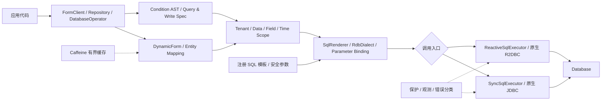

# flying-orm

一个简单、易用、稳定、安全的 ORM 工具，为动态表单而生。

flying-orm 以 Java 对象描述表结构、查询条件和写入计划，由框架生成参数化 SQL。响应式调用使用原生
R2DBC/Reactor，同步调用使用原生 JDBC；两条执行链共享同一套 ORM 规则。它既适合运行时动态维护
表结构和数据，也提供实体 Repository、链式 DML、注册 SQL 模板和受控原生 SQL 入口。

项目首先保证 API 简单、行为稳定和默认安全，再以高性能、低延迟和高吞吐作为持续可测量的目标。

## 主要能力

- **动态表单**：运行时定义、创建和变更表结构，并完成 CRUD、分页、批量写入和元数据反读。
- **参数驱动条件**：Java DSL、请求参数和前端结构化条件最终编译为同一棵条件 AST。
- **可扩展业务条件**：除 `=`、`>`、`like` 外，可以注册 `user-in-org` 一类业务 term。
- **双执行内核**：响应式入口使用原生 R2DBC/Reactor，传统同步入口使用原生 JDBC；两条执行链共享条件 AST、SQL 渲染、方言、参数绑定、映射和安全规则。
- **真正响应式**：R2DBC 执行链端到端非阻塞，不把 JDBC 包进 Reactor，也不通过阻塞桥伪装响应式。
- **安全写入**：租户、数据范围、字段范围、时间范围、逻辑删除和乐观锁使用统一规则。
- **轻量多表查询**：DynamicForm 与实体 Lambda 均支持 `join`、`leftJoin`、`rightJoin`，并继续执行每个表的 Scope 与逻辑删除规则。
- **受保护字段**：只有显式注解或 DynamicForm 声明的字段才启用 AES-GCM 加密、EXACT/SUFFIX/CONTAINS 保护搜索和通用脱敏。
- **有界资源**：查询行数、执行时间、连接等待、LOB 大小、批量规模和缓存容量均可限制。
- **复杂定制查询**：服务端启动时注册 SQL 模板，按稳定 ID 查询，租户等安全参数不能被普通调用覆盖。
- **原生 SQL 逃生口**：也可以直接编写 SQL，但必须使用命名参数绑定，并继续受执行保护约束。

## 环境要求

- Java 21
- Maven 3.9+
- 一个 `DataSource`（同步 JDBC）或 R2DBC `ConnectionFactory`（响应式）；同时提供时，两种入口分别使用对应内核

当前源码基线为 `2.0.0`，尚未发布到远程 Maven 仓库。克隆项目后先安装到本地仓库：

```shell
mvn clean install
```

应用通常只依赖 `flying-orm-rdb`，再按执行方式和数据库选择对应的 JDBC 或 R2DBC 驱动：

```xml
<dependency>
    <groupId>com.flying.orm</groupId>
    <artifactId>flying-orm-rdb</artifactId>
    <version>2.0.0</version>
</dependency>
```

## 五分钟上手

### 1. 创建客户端

方言会根据驱动信息自动识别，普通业务不需要显式选择数据库方言。响应式应用提供
`ConnectionFactory`：

```java
ConnectionFactory connectionFactory = ...;

FlyingOrmClients clients = FlyingOrmClients.builder(connectionFactory)
        .executionOptions(SqlExecutionOptions.maxRows(1000)
                .withMaxResultBytes(64L * 1024 * 1024)
                .withTimeout(Duration.ofSeconds(3)))
        .batchWriteOptions(BatchWriteOptions.atomic(500)
                .withMaxRows(100_000)
                .withTimeout(Duration.ofMinutes(2)))
        .build();

ReactiveFormClient forms = clients.forms();
DatabaseOperator operator = clients.operator();
```

同步应用只需把同一个位置换成 `DataSource`，其余配置保持一致：

```java
DataSource dataSource = ...;

FlyingOrmClients clients = FlyingOrmClients.builder(dataSource).build();
SyncFormClient forms = clients.syncForms();
SyncDatabaseOperator operator = clients.syncOperator();
```

同时提供 `DataSource` 和 `ConnectionFactory` 时，同一个客户端图会装配两套能力；同步入口只走 JDBC，
响应式入口只走 R2DBC，不做阻塞桥接：

```java
FlyingOrmClients clients = FlyingOrmClients.builder(dataSource, connectionFactory).build();
```

`FlyingOrmClients` 是纯 Java 组合器，不持有应用框架生命周期，也不隐藏全局数据源。动态多数据源由上层
完成路由，再把路由后的 `DataSource`、`ConnectionFactory` 和事务参与者交给这一个装配入口。

### 2. 定义动态表单

`DynamicForm` 是运行时表模型。DDL、CRUD、批量、条件类型校验和结果解码都复用这份定义。

```java
DynamicForm userForm = DynamicForm.builder("userForm", "users")
        .addField(DynamicField.primaryKey("id", "BIGINT"))
        .addField(DynamicField.of("name", "VARCHAR"))
        .addField(DynamicField.of("age", "INTEGER"))
        .addField(DynamicField.of("enabled", "BOOLEAN"))
        .addField(DynamicField.of("deleted", "INTEGER"))
        .logicDelete("deleted", 0, 1)
        .build();
```

也可以用链式 DDL 直接创建或同步表结构：

```java
Mono<Long> changed = operator.ddl()
        .createOrAlter("users")
        .addColumn().name("id").number(19).primaryKey().comment("ID").commit()
        .addColumn().name("name").varchar(128).comment("姓名").commit()
        .commit();
```

### 3. 增删改查

动态表单查询默认返回紧凑的 `DynamicRow`。它提供按列名读取和 Map 视图，同时避免每一行都创建完整
`HashMap` 的额外内存开销。

```java
Mono<Long> inserted = forms.insert(WriteSpec.insert(userForm, Map.of(
        "id", 1L,
        "name", "Alice",
        "age", 20,
        "enabled", true
)));

Flux<DynamicRow> rows = forms.select(QuerySpec.of(
        userForm,
        ConditionGroup.and()
                .where("enabled", "=", true)
                .where("age", ">", 18)
                .build()
));

Mono<Long> updated = forms.update(WriteSpec.update(
        userForm,
        Map.of("name", "Alice Chen"),
        ConditionGroup.and().where("id", "=", 1L).build()
));

Mono<Long> deleted = forms.delete(WriteSpec.delete(
        userForm,
        ConditionGroup.and().where("id", "=", 1L).build()
));
```

表单声明逻辑删除后，普通查询会自动排除已删除数据，`delete(...)` 会更新删除标记。只有显式调用
`physicalDelete(...)` 才会真正删除记录。

### 4. 使用链式 DML

需要更接近 SQL 的表达方式时，可以使用 `DatabaseOperator`，值仍然全部走参数绑定：

```java
Flux<DynamicRow> rows = operator.dml()
        .query()
        .select("id", "name")
        .from("users")
        .where(where -> where.is("enabled", true)
                             .term("age", ">", 18))
        .fetchMap();
```

实体查询使用 flying-orm 自有注解（如 `@TableName`、`@TableId`、`@TableField`、`@Version`），通过方法引用避免手写表名和字段名：

```java
Flux<User> users = operator.dml(User.class)
        .query()
        .where(User::isEnabled, true)
        .and(User::getAge, ">", 18)
        .execute();
```

### 5. 承接前端结构化条件

前端传结构化数据，不能传 SQL。字段、operator、值类型、嵌套深度、节点数和集合大小都会在获取连接前校验。

```java
StructuredConditionInput input = StructuredConditionInput.and(
        StructuredConditionInput.term("enabled", "eq", true),
        StructuredConditionInput.term("age", "gt", 18)
);

Flux<DynamicRow> rows = forms.select(
        QuerySpec.structured(userForm, input)
                 .withStructuredPolicy(StructuredConditionPolicies.dynamicForm())
);
```

失败时会返回稳定错误码和具体路径，例如 `conditions[2].value`。租户字段、逻辑删除字段以及没有读取权限的
字段不能由前端条件伪造。

可选搜索条件必须显式使用 `whereIfPresent(...)`。普通 `where(...)` 遇到 `null`、空字符串、纯空白字符串
或清理后为空的集合会在生成 SQL 前失败，不会悄悄删除条件并扩大查询范围。

```java
ConditionGroup where = ConditionGroup.and()
        .where("status", "=", "  enabled  ")
        .whereIfPresent("name", "like-ignore-case", request.name())
        .whereIfPresent("id", "in", request.ids())
        .whereNull("deleted_at")
        .build();
```

`like-ignore-case` 和 `not-like-ignore-case` 会生成参数化的 `lower(字段) like/not like lower(?)`，适用于
H2、MySQL、PostgreSQL、Oracle 和 SQL Server；`%`、`_` 仍按现有 LIKE 通配符语义处理。高频查询应由上层
按目标数据库建立与表达式一致的函数索引、计算列索引或合适的大小写不敏感排序规则，ORM 不会隐藏创建索引。

### 6. 扩展业务条件

业务条件由后端注册固定 SQL 结构，调用方只提供参数。例如：

```java
SqlTermPackage organizationTerms = RelationTermPackage.of(
        "user-organization",
        "org_user",
        "ou",
        "user_id",
        "org_id",
        "user-in-org",
        "user-not-in-org"
);

SqlRenderer renderer = SqlRenderer.builder()
        .addDefaultTerms()
        .addTermPackage(organizationTerms)
        .build();

ConditionGroup where = ConditionGroup.and()
        .where("user_id", "user-in-org", orgId)
        .build();
```

同一 term 可以同时服务 Java DSL、参数驱动条件和前端结构化条件，不需要在不同入口重复实现。

### 7. 注册复杂查询

复杂联表、CTE、聚合、窗口函数和数据库专有查询优先注册为服务端 SQL 模板。SQL 正文只在启动阶段出现，
业务调用只使用稳定模板 ID；租户、用户等安全参数由统一提供器在每次订阅时读取，普通 `bind(...)` 不能伪造。

```java
DataSource dataSource = ...;
ConnectionFactory connectionFactory = ...;

SqlTemplateRegistry templates = SqlTemplateRegistry.builder()
        .register(SqlTemplate.query(
                "monthly-sales",
                """
                with totals as (
                    select department_id, sum(amount) total
                    from sales
                    where tenant_id = :tenantId and created_at >= :startTime
                    group by department_id
                )
                select department_id, total from totals order by total desc
                """,
                Set.of()),
                Set.of("tenantId"))
        .build();

FlyingOrmClients clients = FlyingOrmClients.builder(dataSource, connectionFactory)
        .sqlTemplates(templates)
        .sqlTemplateParameterProvider((templateId, names) -> Mono.deferContextual(context ->
                Mono.just(Map.of("tenantId", context.get("tenantId")))))
        .build();

Flux<DynamicRow> report = clients.operator()
        .sqlTemplate("monthly-sales")
        .bind("startTime", startTime)
        .options(SqlExecutionOptions.maxRows(10_000)
                .withTimeout(Duration.ofSeconds(5)))
        .query();
```

模板入口只执行查询。需要分页、游标或总数时，直接在可信 SQL 中声明对应参数，统计查询注册为另一个模板；
flying-orm 不解析或猜测复杂 SQL 的 `count`，避免错误改写 CTE、窗口函数和数据库专有语法。返回值可以是
`DynamicRow`、Java 类型或自定义 `RowMapper`，同步代码使用 `clients.syncOperator().sqlTemplate(...)`。

### 8. 直接执行 SQL

临时后台查询或不值得注册的数据库特有 SQL 可以使用原生入口。`unsafe` 表示 SQL 文本由使用方负责审核，
不表示参数可以拼接；业务值仍应全部使用命名参数绑定。

```java
Flux<DynamicRow> report = operator
        .unsafeNativeSql("select id, name from users where tenant_id = :tenant and enabled = :enabled")
        .bind("tenant", "t-1")
        .bind("enabled", true)
        .options(SqlExecutionOptions.maxRows(1000)
                .withTimeout(Duration.ofSeconds(3)))
        .query();
```

缺少参数、多余参数和多条 SQL 会在执行前拒绝。该入口仍复用当前方言的参数标记、结果映射、超时、行数上限、
异常分类和观测机制。

## 同步调用

同步 API 用于传统代码或虚拟线程调用场景，直接走原生 JDBC；它与响应式 API 共用上层模型和安全规则，不经过 R2DBC 阻塞桥：

```java
SyncFormClient forms = clients.syncForms();
SyncDatabaseOperator operator = clients.syncOperator();

List<DynamicRow> rows = forms.select(QuerySpec.of(
        userForm,
        ConditionGroup.and().where("enabled", "=", true).build()
));
```

响应式业务优先使用 `ReactiveFormClient` 和 `DatabaseOperator`；同步业务使用对应的 `Sync*` 门面。不要在 Reactor
事件循环线程中调用同步门面。

## 架构

flying-orm 只有一套条件、渲染和安全规则，但有两个彼此独立的原生执行内核：同步 JDBC 和响应式 R2DBC。
动态表单、实体、链式 DML、注册模板与原生 SQL 只是不同的使用入口；两条执行链共享 SQL、事务、错误和结果语义，
不会互相桥接。



### 模块职责

| 模块 | 职责 |
| --- | --- |
| `flying-orm-core` | 动态表单模型、条件 AST、Scope、参数条件、SQL 渲染契约和方言 SPI |
| `flying-orm-rdb` | JDBC/R2DBC 双执行内核、DDL/DML、FormClient、Repository、Operator、类型转换和数据库方言 |
| `flying-orm-testkit` | 数据库兼容、事务故障、并发和资源释放测试工具 |
| `flying-orm-benchmark` | JMH 微基准和真实数据库性能门禁入口 |

项目本体不依赖 Spring，也不包含 starter 或自动配置。应用框架接入与集成验证由仓库外的示例项目维护，不能反向污染 ORM 内核。

## 安全与稳定性

flying-orm 的默认边界包括：

- 所有业务值参数化绑定，标识符通过结构化模型和方言规则处理。
- 更新、删除必须有明确业务条件；Scope 只能继续收窄范围，不能代替业务条件。
- 支持 `TenantScope + DataScope + FieldScope + TimeScope` 组合，无租户系统可以只使用 `DataScope`。
- 乐观锁显式启用；实体声明 `@Version` 后，Repository 和实体 DML 会按版本字段执行冲突检查。
- 批量写入默认 `ATOMIC`，整批成功或整批回滚；需要分片独立提交时显式选择 `INDEPENDENT`。
- 流式批量会在接收每一行时保存参数快照，即使上游为了降低分配而复用同一个 `Object[]`，后续行也不会覆盖已经缓冲的数据。
- 驱动或事务内生成键回调失败时仍会执行事务和资源收尾；回滚无法确认时返回 `UNKNOWN`，不会把连接直接交还连接池。
- 查询、更新、批量和 LOB 读取支持超时与容量限制；R2DBC 连接获取由 ORM 限时，JDBC 连接获取由 DataSource 配置。
- 元数据、SQL 结构计划和实体映射使用 Caffeine 有界缓存，支持淘汰、统计和精确失效。
- 批量结果会区分成功、回滚、部分成功和 `UNKNOWN`。R2DBC 可选事务回执提供恢复令牌和恢复查询；
  JDBC 使用业务唯一键或上层幂等记录确认未知结果。
- SQL 观测默认不携带参数值，避免日志和指标泄漏业务数据。
- 字段加密、保护搜索和业务脱敏只对显式声明字段生效；完整值展示必须由可信后端代码显式选择并自行完成授权。

## 数据库支持

| 数据库 | 当前状态 |
| --- | --- |
| H2 | 开发与测试基线，覆盖动态表单、DDL、CRUD、批量、JSON、LOB 和元数据 |
| MySQL | 正式支持，已完成 MySQL 8.4 实库功能、故障、并发和性能验证 |
| PostgreSQL | 正式支持，另支持原生 Array、数组条件和 pgvector |
| Oracle | 正式支持，覆盖 12c 至 23ai；Oracle Free 23 已完成 JDBC/R2DBC 功能、故障、取消和并发实库认证 |
| SQL Server | 正式支持，覆盖 2012 至 2022 的稳定 SQL 子集，实库认证使用 SQL Server 2022 |
| OpenGauss | 不支持，也不在当前计划中 |

具体驱动版本、数据库版本边界和认证范围见[数据库支持矩阵](docs/database-support-matrix.md)。

## 构建与验证

```shell
# 编译全部模块
mvn -DskipTests package

# 单元测试与质量门禁
mvn -Pquality clean verify

# 源码包、Javadoc 和发布制品检查
mvn -Prelease-artifacts verify
```

测试数量会随功能演进变化，当前验证事实以本次 Maven 输出和发布记录为准；不能把历史测试数量或历史实库报告当成新改动已经通过的证据。

真实数据库认证不会在普通构建中自动启动。固定数据库版本、验证场景和证据要求见
[真实数据库认证方法](docs/real-database-certification.md)；本地 Docker 编排和认证脚本不随源码仓库分发。
性能结果必须来自固定版本、固定参数和可重复执行的环境，不能用一次偶然数据代替门禁。

## 进一步阅读

- [完整 API 示例](docs/target-api-examples.md)
- [轻量 JOIN 与受保护字段](docs/join-and-protected-fields.md)
- [架构设计](docs/flying-orm-architecture-design.md)
- [V2.0.0 JDBC/R2DBC 双执行内核规划](docs/v2.0.0-roadmap.md)
- [数据库支持矩阵](docs/database-support-matrix.md)
- [真实数据库认证方法](docs/real-database-certification.md)
- [错误码手册](docs/error-code-reference.md)
- [公共 API 稳定边界](docs/public-api-stability.md)
- [V2.0.0 发布与迁移说明](docs/v2.0.0-release-notes.md)
- [需求与重要决策索引](docs/requirements/index.md)
- [V1.0.0 发布说明](docs/v1-release-notes.md)
- [已知限制](docs/known-limitations.md)
- [性能基线](docs/performance-baseline-plan.md)
